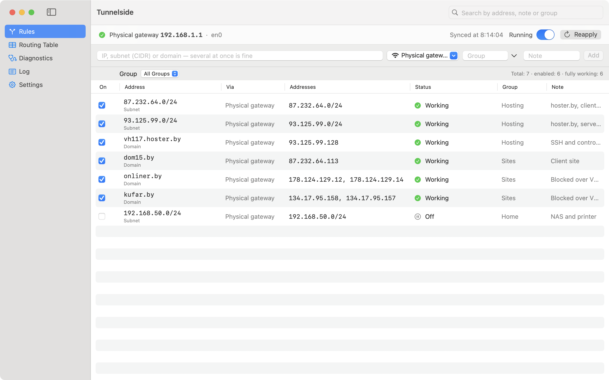
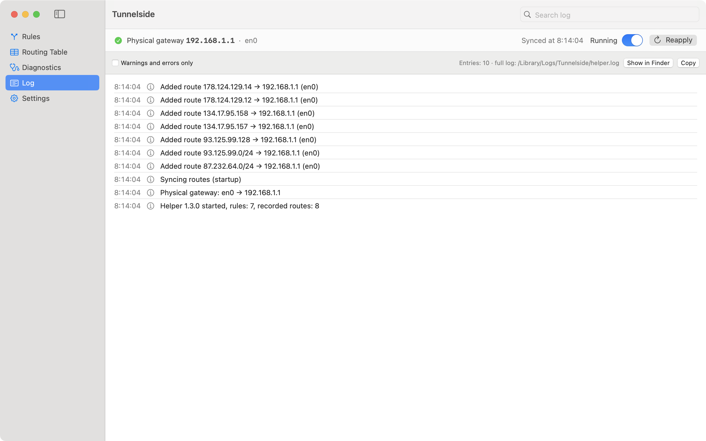

# Tunnelside

**English** · [Русский](README.ru.md)

A macOS menu bar utility that sends selected domains, IP addresses and subnets **around your VPN** — straight through your local network's router. Everything else stays in the tunnel.

<picture>
  <source media="(prefers-color-scheme: dark)" srcset="Design/Screenshots/en-rules-dark.png">
  
</picture>

## Why

A VPN such as WireGuard with `AllowedIPs = 0.0.0.0/0` pushes all traffic into the tunnel. Some sites and servers don't work through it: local hosting providers, sites that block foreign IPs, servers you must reach over SSH from your own address. So you either turn the VPN off or add a route by hand:

```bash
sudo route -n add -host 87.232.64.100 192.168.1.1
```

Tunnelside does the same thing automatically. You add a domain or an address; the app resolves its IPs, finds the gateway of the current network, adds the route and keeps it in place.

WireGuard itself cannot exclude addresses from the tunnel: its config has no such option, and the App Store WireGuard app does not run `PostUp`/`PostDown` scripts. A separate route through the network gateway is the working way.

## Features

- **Rules** — a domain, an IP or a subnet (CIDR). Each rule has its own switch, a note and a group; a whole group can be turned on or off at once. Paste several addresses separated by spaces or commas, or a full link: only the domain is taken from `https://example.com/page`.
- **Domains** — addresses are resolved through your network's DNS, not through the VPN, and refreshed every 10 minutes (from 1 minute to 1 day). When a domain's IP changes, the old address stays routed for 6 more hours (0 to 168 hours) so open connections don't break.
- **Network changes** — the gateway is detected on every check. Switch Wi‑Fi, plug in a cable, wake the Mac — routes move to the new gateway. The background service watches network and routing table changes and also re-checks everything every 30 seconds.
- **Respects existing routes** — if the same route already existed (for example, added by hand), it stays when the rule is removed.
- **Routing table** — the whole IPv4 kernel table, with a search for stale static routes.
- **Diagnostics** — which interface and gateway an address really uses, what DNS answers through the VPN and directly, whether a TCP connection goes through.
- **Log** — every route added or removed, domain addresses, gateway changes.
- **English and Russian** — the app follows the system language.

<picture>
  <source media="(prefers-color-scheme: dark)" srcset="Design/Screenshots/en-logs-dark.png">
  
</picture>

## Install

You need macOS 14 or later and the Command Line Tools. **Xcode is not required.** If the tools are missing, `xcode-select --install` installs them.

```bash
git clone https://github.com/KirillKarmanov/Tunnelside.git
cd Tunnelside
scripts/make-signing-cert.sh   # once per Mac: a code signing certificate
scripts/build-spm.sh           # build → build/Tunnelside.app
cp -R build/Tunnelside.app /Applications/
open /Applications/Tunnelside.app
```

On first launch open the main window (menu bar icon → "Open Main Window") and click **"Install Background Service"**. macOS asks for the administrator password once.

`make-signing-cert.sh` creates a free self-signed certificate "Tunnelside Local Signing" in the login keychain, valid for 10 years. No paid Apple Developer account is needed. If macOS asks for access to the key during the build, click "Always Allow".

**Coming from MacOSRoute?** Installing the Tunnelside service stops and removes the MacOSRoute service and carries over its rules and routes. You can then delete MacOSRoute.app.

## Usage

**Add a domain or address:** menu bar icon → the "Add IP / domain" field → Return. Or in the main window, "Rules" section, where you can also set a note and a group.

**Turn on, off, remove:** the switch next to a rule in the menu bar, or right-click a rule in the main window.

**Example** — all sites and servers of one hosting provider are easier to cover with subnets than address by address:

```
87.232.64.0/24 93.125.99.0/24
```

**Uninstall:** "Settings" → "Uninstall…". The app removes all its routes and the background service.

## Security

Routes are changed by a background service running as root, so it matters who can command it:

- The service accepts commands **only from an app signed with the same certificate as the service itself** — it checks the certificate fingerprint. A program that merely calls itself Tunnelside is rejected. A service built without a certificate rejects everyone.
- Only users in the admin group can connect.
- Rules wider than `/8` (`0.0.0.0/0`, pairs of `/1` and so on) are refused by both the app and the service: one such line would send almost all traffic around the VPN.
- The service runs no arbitrary commands: it only adds and removes routes via `/sbin/route`, with arguments passed without a shell.
- The app and the service are built with the hardened runtime, so foreign code cannot be injected via `DYLD_INSERT_LIBRARIES`.

**What is visible from outside.** DNS queries for domains in your rules go in the clear through your network: first to the network's DNS server, then, if it fails, to 1.1.1.1, 8.8.8.8 or 9.9.9.9. Your provider can see which domains you send around the VPN. The app has no telemetry, analytics or auto-updates.

## Limitations

- IPv4 only.
- A domain rule sends the domain's IP addresses around the VPN. If a site sits behind a CDN (for example, Cloudflare), other sites share those addresses and will bypass the VPN too. Subdomains need their own rules.
- If the browser gets different addresses from DNS through the VPN than the service gets through the network, the route may not match. For that case you can switch DNS to "System DNS" in Settings.

## Where things live

| What | Where |
|---|---|
| Rules and state | `/Library/Application Support/Tunnelside/` |
| Service log | `/Library/Logs/Tunnelside/helper.log` |
| Service | `/Library/PrivilegedHelperTools/io.github.kirillkarmanov.Tunnelside.helper` |
| Its launchd job | `/Library/LaunchDaemons/io.github.kirillkarmanov.Tunnelside.helper.plist` |

## Development

```bash
swift build                      # debug build
swift test                       # tests (Swift Testing, works without Xcode)
scripts/build-spm.sh             # signed .app with a security self-check
scripts/screenshots-spm.sh       # retake the README screenshots
```

`scripts/build-spm.sh` finally checks that the service accepts the built app and rejects a fake with the same identifier. If the check fails, the build fails.

`scripts/screenshots-spm.sh` starts a demo service as a regular user in dry-run mode: system routes are not changed. Demo rules are in `Design/Screenshots/demo-config.en.json` and `demo-config.ru.json`.

Interface texts are written in place as `L("English", "Русский")`; the service gets the language from the app along with its configuration.

When you change the service code or the app–service protocol, bump `RouteConstants.helperVersion` — the app will offer to update the installed service. Rebuilding with the same certificate needs no reinstall: the service checks the certificate, not the hash of a particular build.

## Origin

Tunnelside grew out of [MacOSRoute](https://github.com/castorworks/MacOSRoute) by Chongqing Hyperits Network Technology Co., Ltd. What changed:

- build and tests without Xcode (`Package.swift`, `scripts/build-spm.sh`);
- with self-signing, the service checks the client's certificate; the original, without an Apple Developer certificate, checked only the app identifier, which any program can claim;
- rules wider than `/8` are refused;
- fallback DNS 1.1.1.1, 8.8.8.8, 9.9.9.9 instead of 223.5.5.5 and 119.29.29.29;
- English and Russian interface instead of Chinese.

## License

[MIT](LICENSE). © 2026 Kirill Karmanov; original MacOSRoute © 2026 Chongqing Hyperits Network Technology Co., Ltd.
