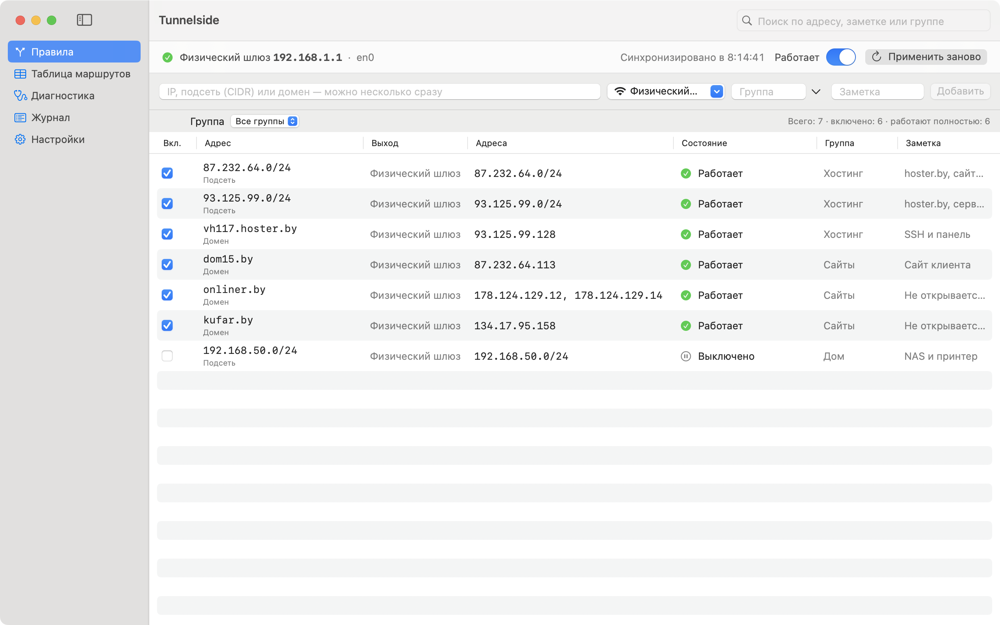
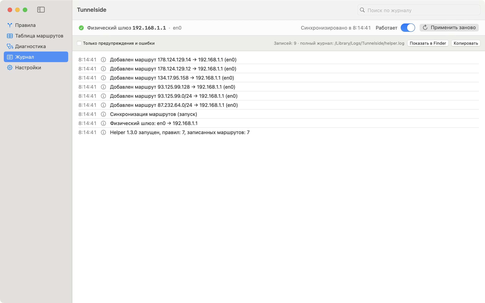

# Tunnelside

[English](README.md) · **Русский**

Утилита для строки меню macOS: выбранные домены, IP-адреса и подсети идут **мимо VPN** — напрямую через роутер вашей сети. Остальной трафик остаётся в туннеле.

<picture>
  <source media="(prefers-color-scheme: dark)" srcset="Design/Screenshots/ru-rules-dark.png">
  
</picture>

## Зачем

VPN вроде WireGuard с `AllowedIPs = 0.0.0.0/0` заворачивает в туннель весь трафик. Часть сайтов и серверов через него не открывается: белорусские хостинги, сайты, которые режут иностранные IP, серверы, куда нужно ходить по SSH со своего адреса. Приходится либо выключать VPN, либо вручную прописывать маршрут:

```bash
sudo route -n add -host 87.232.64.100 192.168.1.1
```

Tunnelside делает то же самое автоматически. Вы добавляете домен или адрес, а приложение само узнаёт его IP, находит шлюз текущей сети, прокладывает маршрут и следит, чтобы он не пропал.

Исключить адреса из туннеля средствами самого WireGuard нельзя: в его конфиге нет такой настройки, а приложение WireGuard из App Store не принимает скрипты `PostUp`/`PostDown`. Отдельный маршрут через шлюз сети — единственный рабочий способ.

## Возможности

- **Правила** — домен, IP или подсеть (CIDR). У каждого правила свой переключатель, заметка и группа; группу можно включить или выключить целиком. Можно вставить сразу несколько адресов через пробел или запятую, а также ссылку целиком: из `https://example.by/page` возьмётся только домен.
- **Домены** — адреса домена запрашиваются через DNS вашей сети, а не через VPN, и обновляются каждые 10 минут (настраивается от 1 минуты до суток). Если у домена сменился IP, старый адрес ещё 6 часов остаётся в маршрутах (настраивается от 0 до 168 часов), чтобы не обрывались открытые соединения.
- **Смена сети** — шлюз определяется автоматически при каждой проверке. Сменили Wi‑Fi, подключили кабель, вывели Mac из сна — маршруты перестраиваются на новый шлюз. Фоновая служба следит за изменениями сети и таблицы маршрутов и дополнительно сверяет всё раз в 30 секунд.
- **Бережность к чужим маршрутам** — если такой же маршрут уже был в системе (например, прописанный вручную), при удалении правила он остаётся на месте.
- **Таблица маршрутов** — вся IPv4-таблица ядра с поиском устаревших статических маршрутов.
- **Диагностика** — через какой интерфейс и шлюз реально идёт адрес, что отвечает DNS через VPN и напрямую, проходит ли TCP-соединение.
- **Журнал** — все добавления и удаления маршрутов, адреса доменов, смены шлюза.
- **Русский и английский** — приложение следует языку системы.

<picture>
  <source media="(prefers-color-scheme: dark)" srcset="Design/Screenshots/ru-logs-dark.png">
  
</picture>

## Установка

Нужны macOS 14 или новее и Command Line Tools. **Xcode не нужен.** Если инструментов нет, их ставит команда `xcode-select --install`.

```bash
git clone https://github.com/KirillKarmanov/Tunnelside.git
cd Tunnelside
scripts/make-signing-cert.sh   # один раз на Mac: сертификат для подписи
scripts/build-spm.sh           # сборка → build/Tunnelside.app
cp -R build/Tunnelside.app /Applications/
open /Applications/Tunnelside.app
```

При первом запуске откройте главное окно (значок в строке меню → «Открыть главное окно») и нажмите **«Установить фоновую службу»**. macOS один раз спросит пароль администратора.

`make-signing-cert.sh` создаёт в связке ключей «Вход» бесплатный самоподписанный сертификат «Tunnelside Local Signing» сроком на 10 лет. Платный аккаунт разработчика Apple не нужен. Если при сборке macOS спросит доступ к ключу, нажмите «Всегда разрешать».

**Переходите с MacOSRoute?** При установке службы Tunnelside служба MacOSRoute останавливается и удаляется, а её правила и маршруты переходят к Tunnelside. После этого MacOSRoute.app можно удалить.

## Как пользоваться

**Добавить домен или адрес:** значок в строке меню → поле «Добавить IP / домен» → Enter. Или в главном окне, раздел «Правила»: там же можно указать заметку и группу.

**Включить, выключить, удалить:** переключатель у правила в строке меню, либо правый клик по правилу в главном окне.

**Пример** — все сайты и серверы на одном хостинге проще закрыть подсетями, чем добавлять каждый адрес:

```
87.232.64.0/24 93.125.99.0/24
```

**Удалить:** «Настройки» → «Удалить…». Приложение уберёт все свои маршруты и фоновую службу.

## Безопасность

Маршруты меняет фоновая служба с правами root. Поэтому важно, кто может ей командовать:

- Служба принимает команды **только от приложения, подписанного тем же сертификатом, что и она сама**, — сверяется отпечаток сертификата. Программа, которая просто назовётся Tunnelside, получит отказ. Служба, собранная без сертификата, отказывает всем.
- Подключаться могут только пользователи из группы администраторов.
- Правила шире `/8` (`0.0.0.0/0`, пары `/1` и т. п.) не принимают ни приложение, ни служба: одной такой строкой можно увести мимо VPN почти весь трафик.
- Служба не выполняет произвольных команд: она только добавляет и удаляет маршруты через `/sbin/route`, аргументы передаются без оболочки.
- Приложение и служба собираются с hardened runtime, так что подгрузить в них чужой код через `DYLD_INSERT_LIBRARIES` нельзя.

**Что видно снаружи.** Запросы к DNS для доменов из правил идут открыто через вашу сеть: сначала к DNS-серверу сети, при недоступности — к 1.1.1.1, 8.8.8.8 или 9.9.9.9. Провайдер видит, какие домены вы пускаете мимо VPN. Телеметрии, аналитики и автообновлений в приложении нет.

## Ограничения

- Только IPv4.
- Правило для домена направляет мимо VPN IP-адреса этого домена. Если сайт стоит за CDN (например, Cloudflare), на тех же адресах живут и чужие сайты — они тоже пойдут мимо VPN. Поддомены нужно добавлять отдельными правилами.
- Если браузер получает от DNS через VPN другие адреса, чем служба через сеть, маршрут может не совпасть. На такой случай в «Настройках» можно переключить DNS на системный.

## Где что лежит

| Что | Где |
|---|---|
| Правила и состояние | `/Library/Application Support/Tunnelside/` |
| Журнал службы | `/Library/Logs/Tunnelside/helper.log` |
| Служба | `/Library/PrivilegedHelperTools/io.github.kirillkarmanov.Tunnelside.helper` |
| Её запуск | `/Library/LaunchDaemons/io.github.kirillkarmanov.Tunnelside.helper.plist` |

## Разработка

```bash
swift build                      # отладочная сборка
swift test                       # тесты (Swift Testing, работает без Xcode)
scripts/build-spm.sh             # готовый .app с подписью и самопроверкой защиты
scripts/screenshots-spm.sh       # пересъёмка скриншотов для README
```

`scripts/build-spm.sh` в конце проверяет, что служба примет собранное приложение и отклонит подделку с тем же идентификатором. Если проверка не прошла, сборка завершается ошибкой.

`scripts/screenshots-spm.sh` запускает демо-службу от обычного пользователя в холостом режиме: системные маршруты не меняются. Правила для скриншотов лежат в `Design/Screenshots/demo-config.en.json` и `demo-config.ru.json`.

Тексты интерфейса пишутся на месте как `L("English", "Русский")`; язык служба получает от приложения вместе с конфигурацией.

При изменении кода службы или протокола между приложением и службой увеличьте `RouteConstants.helperVersion` — приложение предложит обновить установленную службу. Пересборка тем же сертификатом переустановки не требует: служба сверяет сертификат, а не хэш конкретной сборки.

## Происхождение

Tunnelside вырос из [MacOSRoute](https://github.com/castorworks/MacOSRoute) компании Chongqing Hyperits Network Technology Co., Ltd. Что изменено:

- сборка и тесты без Xcode (`Package.swift`, `scripts/build-spm.sh`);
- при собственной подписи служба проверяет сертификат клиента; в оригинале без сертификата Apple Developer проверялось только имя приложения, которое может присвоить себе любая программа;
- запрет правил шире `/8`;
- запасные DNS 1.1.1.1, 8.8.8.8, 9.9.9.9 вместо 223.5.5.5 и 119.29.29.29;
- интерфейс на английском и русском вместо китайского.

## Лицензия

[MIT](LICENSE). © 2026 Kirill Karmanov; оригинальный MacOSRoute © 2026 Chongqing Hyperits Network Technology Co., Ltd.
